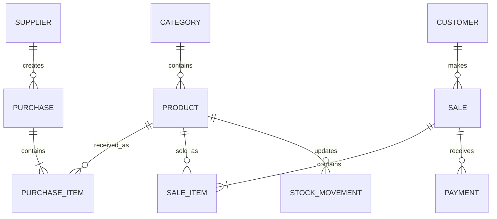

# Database Design

> **Project:** Business Pulse  
> **Version:** 1.0 (MVP)  
> **Database:** PostgreSQL  
> **ORM:** SQLAlchemy 2.0  

---

# Overview

The database is the heart of Business Pulse.

Its purpose is to accurately represent how a small business operates while preserving historical records for reporting, analytics, and AI-powered insights.

The database is designed using relational database principles and serves as the single source of truth for the application.

The first version of Business Pulse focuses on:

- Inventory Management
- Sales
- Customers
- Suppliers
- Payments
- Purchase Tracking
- Reporting
- AI-assisted data entry

---

# Design Goals

The database has been designed with the following goals:

- Keep business data consistent.
- Preserve historical records.
- Support AI-assisted workflows.
- Support offline operation.
- Be easy to extend.
- Separate business logic from storage.

# Design Principles

## 1. Single Source of Truth

Every piece of business information should exist in one place only.

For example, a product's information belongs in the `Product` table.

Other tables reference products using foreign keys instead of duplicating information.

## 2. Store Business Events

Instead of storing only the latest state of the business, the system stores the events that caused those changes.

Examples include:

- Receiving stock
- Selling products
- Receiving customer payments
- Damaged stock
- Stolen stock

This makes auditing and reporting possible.

## 3. Preserve History

Historical information should never be lost.

Instead of overwriting records, the system creates new records whenever possible.

For example:

- Every payment is stored.
- Every sale is stored.
- Every inventory movement is stored.

## 4. AI Is Not The Source of Truth

AI is an assistant.

AI may:

- Transcribe speech
- Extract structured information
- Generate reports
- Answer business questions

However, AI never writes directly to the database.

All database operations pass through the business service layer.

## 5. Database Before Interface

The database models the business.

It is **not** designed around Streamlit pages.

This allows the application to support:

- Desktop
- Web
- Mobile
- REST API

without changing the database.

## Entity Relationship Diagram



## Table Definitions

This section defines every table in the database.

Each table includes:

- Purpose
- Columns
- Primary Key
- Foreign Keys
- Constraints
- Relationships
- Business Rules

## Category

### Purpose
---

The Category table groups similar products together.

Examples:

- Shoes
- Bags
- Clothes
- Food Flask

A category can contain many products.

### Columns
---

| Column | Type | Nullable | Description |
|----------|----------|----------|-------------|
| id | UUID | No | Primary Key |
| name | VARCHAR(100) | No | Category name |
| description | TEXT | Yes | Optional description |
| created_at | TIMESTAMP | No | Record creation date |
| updated_at | TIMESTAMP | No | Last modification |

### Primary Key
---

```text
id
```

### Foreign Keys

---

None

### Relationships

---

``` text
Category (1)

↓

Product (Many)
```

### Constraints

---

- Category name must be unique.
- Category name cannot be empty.

### Business Rules

---

- A category may contain zero or many products.
- Deleting a category with existing products is not allowed.

---

## Product

### Purpose

---

Stores every product that is to be sold by the business.

Examples:

- Black Leather Handbag
- Women's Sneakers
- Electric Food Flask

This table represents the product itself, **not** a sale.

### Columns

---

| Column | Type | Nullable | Description |
|----------|----------|----------|-------------|
| id | UUID | No | Primary Key |
| category_id | UUID | No | Product category |
| name | VARCHAR(150) | No | Product name |
| description | TEXT | Yes | Product description |
| cost_price | DECIMAL(12,2) | No | Current cost price |
| target_price | DECIMAL(12,2) | No | Preferred selling price |
| minimum_price | DECIMAL(12,2) | No | Lowest recommended selling price |
| current_stock | INTEGER | No | Quantity currently available |
| is_active | BOOLEAN | No | Active/Inactive product |
| created_at | TIMESTAMP | No | Record creation |
| updated_at | TIMESTAMP | No | Last modification |

---

### Primary Key

---

```text
id
```

### Foreign Keys

---

| Column | References |
|----------|------------|
| category_id | Category(id) |

---

### Relationships

---

```text
Category (1)

↓

Product (Many)

Product (1)

↓

PurchaseItem (Many)

Product (1)

↓

SaleItem (Many)

Product (1)

↓

StockMovement (Many)
```

---

### Constraints

---

- Product name cannot be empty.
- Current stock cannot be negative.
- Cost price must be greater than or equal to zero.
- Target price must be greater than or equal to minimum price.
- Minimum price must be greater than or equal to cost price.

### Business Rules

---

- Selling price is **not stored** in this table.
- Current stock is updated only after creating a StockMovement record.
- Products are never physically deleted.
- Products are marked inactive when discontinued.

---

## Supplier

### Purpose

---

Stores information about suppliers.

For Version 1 this includes your mum's business partner who imports goods from China.

A supplier may supply many purchases.

### Columns

---

| Column | Type | Nullable | Description |
|----------|----------|----------|-------------|
| id | UUID | No | Primary Key |
| name | VARCHAR(150) | No | Supplier name |
| phone | VARCHAR(20) | Yes | Phone number |
| address | TEXT | Yes | Address |
| notes | TEXT | Yes | Additional notes |
| created_at | TIMESTAMP | No | Record creation |
| updated_at | TIMESTAMP | No | Last modification |

---

### Primary Key

---

```text
id
```

### Foreign Keys

---

None

### Relationships

---

```text
Supplier (1)

↓

Purchase (Many)
```

---

### Constraints

---

- Supplier name cannot be empty.

### Business Rules

---

- A supplier can supply many purchases.
- A purchase must belong to exactly one supplier.
- Suppliers should not be deleted if purchase history exists.

---

## Purchase

### Purpose

---

Represents one shipment or receipt of goods from a supplier.

A purchase does **not** store products directly.

Instead, products are stored inside the PurchaseItem table.

### Columns

---

| Column | Type | Nullable | Description |
|----------|----------|----------|-------------|
| id | UUID | No | Primary Key |
| supplier_id | UUID | No | Supplier |
| purchase_date | DATE | No | Date received |
| notes | TEXT | Yes | Additional notes |
| created_at | TIMESTAMP | No | Record creation |

---

### Primary Key

---

```text
id
```

---

### Foreign Keys

---

| Column | References |
|----------|------------|
| supplier_id | Supplier(id) |

---

### Relationships

---

```text
Supplier (1)

↓

Purchase (Many)

Purchase (1)

↓

PurchaseItem (Many)
```

### Constraints

---

- Purchase date is required.
- Supplier is required.

### Business Rules

---

- One purchase can contain many products.
- Every PurchaseItem automatically creates a StockMovement of type RECEIVED.
- Purchases are permanent historical records and should never be deleted.

---

## PurchaseItem

### Purpose

---

Stores every product included in a purchase.

One purchase may contain multiple products.

Example:

Purchase #001

- Shoes × 20
- Handbags × 15
- Food Flask × 10

### Columns

---

| Column | Type | Nullable | Description |
|----------|----------|----------|-------------|
| id | UUID | No | Primary Key |
| purchase_id | UUID | No | Purchase |
| product_id | UUID | No | Product |
| quantity | INTEGER | No | Quantity received |
| unit_cost | DECIMAL(12,2) | No | Cost per item |

### Primary Key

---

```text
id
```

### Foreign Keys

---

| Column | References |
|----------|------------|
| purchase_id | Purchase(id) |
| product_id | Product(id) |

### Relationships

---

```text
Purchase (1)

↓

PurchaseItem (Many)

Product (1)

↓

PurchaseItem (Many)
```

### Constraints

---

- Quantity must be greater than zero.
- Unit cost must be greater than or equal to zero.

### Business Rules

---

- Creating a PurchaseItem automatically:
  - increases Product.current_stock
  - creates a StockMovement record of type RECEIVED
- Purchase items should never be modified after confirmation to preserve inventory history.

---

## Customer

### Purpose

---

Stores information about customers.
Customers may:

- Buy products
- Purchase on credit
- Make multiple payments
- Have multiple sales over time

A customer record allows the business to build purchase history and track outstanding balances.

---

### Columns

---

| Column | Type | Nullable | Description |
|----------|----------|----------|-------------|
| id | UUID | No | Primary Key |
| name | VARCHAR(150) | No | Customer name |
| phone | VARCHAR(20) | Yes | Phone number |
| address | TEXT | Yes | Customer address |
| notes | TEXT | Yes | Additional information |
| created_at | TIMESTAMP | No | Record creation |
| updated_at | TIMESTAMP | No | Last modification |

---

### Primary Key

```text
id
```

### Foreign Keys

---
None

### Relationships

---

```text
Customer (1)
↓
Sale (Many)

```

### Constraints

---

- Customer name cannot be empty.
- Phone number is optional.
- Duplicate customer names are allowed because different customers may share the same name.


## Business Rules
- Walk-in customers do not need a customer record.
- A customer may have many sales.
- Customer records should never be deleted if sales exist.

---

## Sale

### Purpose

---

Represents a single customer transaction.
A Sale acts as the receipt header.

It stores general transaction information but **does not store individual products**.
Products are stored in the SaleItem table.

### Columns

---

| Column | Type | Nullable | Description |
|----------|----------|----------|-------------|
| id | UUID | No | Primary Key |
| customer_id | UUID | Yes | Customer (nullable for walk-in customers) |
| sale_date | TIMESTAMP | No | Date and time of sale |
| subtotal | DECIMAL(12,2) | No | Total before discounts |
| discount | DECIMAL(12,2) | No | Discount applied |
| total_amount | DECIMAL(12,2) | No | Final amount due |
| amount_paid | DECIMAL(12,2) | No | Amount paid so far |
| remaining_balance | DECIMAL(12,2) | No | Outstanding balance |
| payment_status | VARCHAR(20) | No | PAID, PARTIAL, UNPAID |
| collection_status | VARCHAR(20) | No | COLLECTED, PENDING_COLLECTION |
| notes | TEXT | Yes | Additional notes |
| created_at | TIMESTAMP | No | Record creation |

---

### Primary Key

---

```text
id
```

---

### Foreign Keys

---

| Column | References |
|----------|------------|
| customer_id | Customer(id) |

---

### Relationships

---

```text

Customer (1)
↓
Sale (Many)

Sale (1)
↓
SaleItem (Many)

Sale (1)
↓
Payment (Many)
```

### Constraints

---

- Total amount cannot be negative.
- Remaining balance cannot be negative.
- Amount paid cannot exceed total amount.
- Payment status must be:  
    - PAID  
    - PARTIAL  
    - UNPAID

### Business Rules

---

- One sale can contain many products.
- A sale may belong to a customer.- Walk-in sales are allowed.
- A sale becomes complete only after at least one SaleItem exists.
- Sales are permanent business records and should never be deleted.

---

## SaleItem

### Purpose

---

Stores every product sold during a sale.
One sale may contain many SaleItems.
Each SaleItem stores the negotiated selling price.

### Columns

---

| Column | Type | Nullable | Description |
|----------|----------|----------|-------------|
| id | UUID | No | Primary Key |
| sale_id | UUID | No | Sale |
| product_id | UUID | No | Product |
| quantity | INTEGER | No | Quantity sold |
| unit_price | DECIMAL(12,2) | No | Actual negotiated selling price |
| cost_price | DECIMAL(12,2) | No | Cost price at time of sale |
| line_total | DECIMAL(12,2) | No | Quantity × Unit Price |

---

### Primary Key

---

```text
id
```

### Foreign Keys

---

| Column | References |
|----------|------------|
| sale_id | Sale(id) |
| product_id | Product(id) |

---

### Relationships

---

```text
Sale (1)
↓
SaleItem (Many)

Product (1)
↓
SaleItem (Many)
```

### Constraints

---

- Quantity must be greater than zero.
- Unit price must be greater than zero.
- Cost price must be greater than or equal to zero.

### Business Rules

---

- Each SaleItem represents one product.
- A SaleItem always belongs to one Sale.
- A SaleItem always belongs to one Product.
- Creating a SaleItem automatically:  
- decreases Product.current_stock  
- creates a StockMovement record of type SOLD

## Payment

### Purpose

---

Stores every payment made toward a sale.
This allows:

- Full payment
- Partial payment
- Installment payments

A sale can have multiple payment records.

---

### Columns

---

| Column | Type | Nullable | Description |
|----------|----------|----------|-------------|
| id | UUID | No | Primary Key |
| sale_id | UUID | No | Sale |
| amount | DECIMAL(12,2) | No | Amount received |
| payment_method | VARCHAR(30) | No | Cash, Transfer, POS, etc. |
| payment_date | TIMESTAMP | No | Payment date |
| reference | VARCHAR(100) | Yes | Transaction reference |
| notes | TEXT | Yes | Additional notes |

---

### Primary Key

---

```text
id
```

---

### Foreign Keys

---
| Column | References |
|----------|------------|
| sale_id | Sale(id) |

---

### Relationships

---

```text
Sale (1)
↓
Payment (Many)
```

### Constraints

---

- Payment amount must be greater than zero.
- Payment method is required.

### Business Rules

---

- One sale may have multiple payments.
- Recording a payment updates:  
    - amount_paid  
    - remaining_balance  
    - payment_status
    - Payments are permanent financial records.

---

## StockMovement

### Purpose

---

Tracks every inventory change.
Inventory should never change without creating a StockMovement record.

This table provides a complete audit trail of inventory history.

### Columns

---

| Column | Type | Nullable | Description |
|----------|----------|----------|-------------|
| id | UUID | No | Primary Key |
| product_id | UUID | No | Product |
| movement_type | VARCHAR(30) | No | RECEIVED, SOLD, DAMAGED, STOLEN, ADJUSTMENT |
| quantity | INTEGER | No | Quantity moved |
| reference_type | VARCHAR(30) | No | Purchase, Sale, Damage, Theft |
| reference_id | UUID | Yes | Related business record |
| movement_date | TIMESTAMP | No | Date of movement |
| notes | TEXT | Yes | Additional information |

---

### Primary Key

---

```text
id
```

### Foreign Keys

---

| Column | References |
|----------|------------|
| product_id | Product(id) |

---

### Relationships

---

```text
Product (1)
↓
StockMovement (Many)
```

### Constraints

---

- Quantity must be greater than zero.
- Movement type must be one of:  
    - RECEIVED  
    - SOLD  
    - DAMAGED  
    - STOLEN  
    - ADJUSTMENT

### Business Rules

---

- Every inventory change creates a StockMovement record.
- StockMovement records are immutable.
- Product.current_stock is updated whenever a StockMovement is created.
- Stock history is never deleted.

---

## Version 1 Assumptions

The MVP makes the following assumptions:

- Single business location.
- Single user.
- No barcode scanning.
- No product images.
- No product variants (size, color).
- No user authentication.
- No expense tracking.
- No purchase returns.
- No customer returns (unless manually handled).
- AI assists with data entry but never writes directly to the database.
These assumptions keep the initial implementation simple while leaving room for future expansion.

## Database Implementation Notes

This section documents implementation decisions that affect the PostgreSQL schema and application logic.

## UUID Strategy

All primary keys use UUID v4.

Reasons:

- Better support for future synchronization.
- Easier offline operation.
- Easier migration to cloud deployment.
- Prevents predictable sequential IDs.

## Timestamp Strategy

Every table should contain:

- created_at
- updated_at

except tables where updates are unnecessary (for example Payment).

All timestamps are stored in UTC.

## Soft Deletes

Version 1 does not support soft deletes.

Business records such as:

- Sales
- Payments
- Purchases
- Stock Movements

must never be deleted.

Instead, correction records should be created.

Products may be marked inactive using:

is_active = false

## Inventory Rules

Inventory never changes directly.

Allowed inventory operations:

- Receive Stock
- Sell Stock
- Damage Stock
- Theft
- Manual Adjustment

Every operation:

1. Creates a StockMovement.
2. Updates Product.current_stock.

## Pricing Rules

Product stores:

- Cost Price
- Target Price
- Minimum Price

SaleItem stores:

- Actual Selling Price
- Cost Price at Time of Sale

Historical sales must never change if product prices change later.

## Payment Rules

Payment history is immutable.

A payment cannot be edited after creation.

Corrections are made by creating adjustment records.

## Reporting Strategy

Reports should be generated from transactional tables.

Examples:

Sales Report

Source:

- Sale
- SaleItem

Inventory Report

Source:

- Product
- StockMovement

Supplier Report

Source:

- Purchase
- PurchaseItem

Customer Report

Source:

- Sale
- Payment

AI Insights

Source:

All transactional tables.

AI should never rely on cached values.

## Future Improvements

Version 2 may introduce:

- Product Images
- Barcode Support
- Multiple Branches
- Authentication
- Roles & Permissions
- Purchase Returns
- Customer Returns
- Expenses
- AI Chat History
- Notifications
- Audit Logs

The current schema has been designed so these features can be added with minimal restructuring.

## Final Notes

Business Pulse follows an event-driven design.

Instead of storing only the latest state of the business, it records the business events responsible for every important change.

This design improves:

- Reporting
- Auditing
- AI Analysis
- Business Intelligence
- Future Scalability

The database is considered the foundation of the application. Business services, Streamlit pages, Docker containers, and AI components are all built on top of this schema.